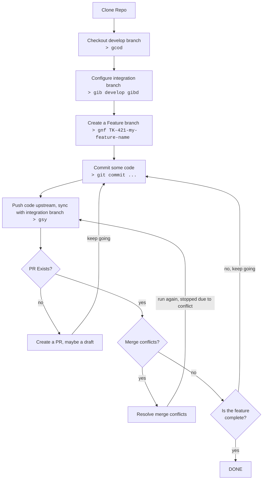

# Forest's Dotfiles

I :heart: dotfiles.

## About

Dotfiles are what power your system. These are mine. They're mostly for OS X since that's what I use. My default shell
these days is zsh. I use [oh-my-zsh](https://ohmyz.sh/) for managing lots of common stuff. All of the dotfile
management is done with [rcm](https://github.com/thoughtbot/rcm) and packages are managed with homebrew.

## Whats in it?

- Defaults for vim, tmux, git, iex, psql, and zsh shell.
- Version management for elixir, erlang, ruby, node, direnv, etc (via. asdf)
- Lots of aliases for common commands.
- Installation software via [homebrew](https://brew.sh/). See Brewfile.
- [Starship](https://starship.rs/) terminal prompt configuration.
- [Hammerspoon](https://www.hammerspoon.org/) configuration for macOS automation.
- [Dash](https://kapeli.com/dash) settings for offline docs and code snippets.
- [iTerm](https://iterm2.com/) themes
- [Nerd Fonts](https://www.nerdfonts.com/)

## Install

Running `./bootstrap.sh` will install all dependencies and create symlinks to all of the dotfiles. I try to make sure
its up to date but every now and then there is a missing dependency. If you want to set up your mac with the same
defaults that I do you can also run `./set-defaults.sh`. If you need to add new dotfiles or symlinks in the future then
you can simply run `rcup` in the dotfiles dir.

## Most Frequently Used Commands

### Git

- `gcom` - check out the default branch
- `gib` - set the integration branch (defaults to `main`)
- `gnf` - create a new feature branch based on the integration branch
- `gsy` - sync branch with upstream integration branch and push to origin
- `gpl` - pull
- `gpc` - push the current branch to origin

### Elixir

- `im` - run app in iex
- `mtw` - run tests in watch mode
- `mtws` - run tests in watch mode, only rerun stale tests
- `mps` - run the Phoenix server
- `mdg` - get mix dependencies
- `mqc` - run the quick check mix task alias
- `mcov` - run tests with coverage and open the results
- `notebooks` - start [Livebook](https://livebook.dev/)

### Other

- `de` - edit these dotfiles
- [fzf](https://github.com/junegunn/fzf) - command-line fuzzy finder (ctrl-r)
- `pgst` - start postgres db
- `pgsp` - stop postgres db
