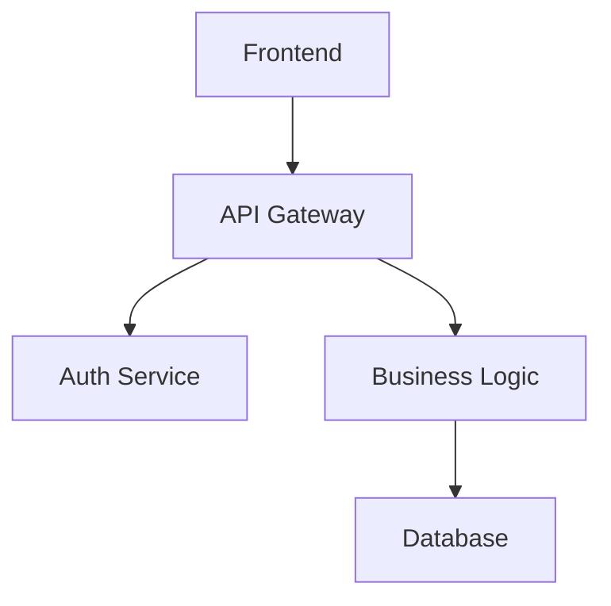
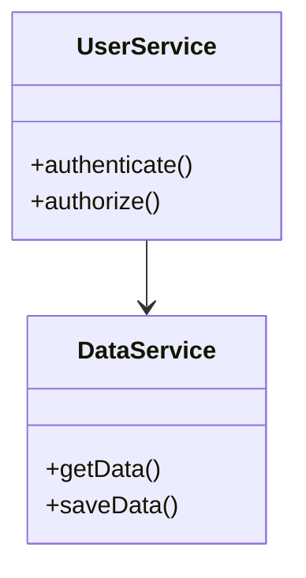
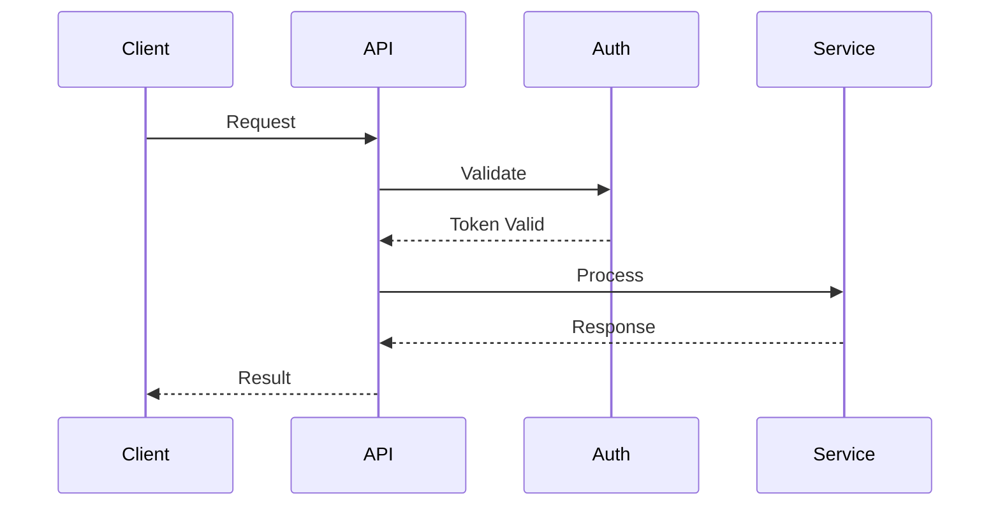

# Codebase Summary

## Overview

This sop analyzes a codebase and generates comprehensive documentation including structured metadata files that describe the system architecture, components, interfaces, and workflows. It can create targeted documentation files like AGENTS.md (README for AI agents), README.md, CONTRIBUTING.md, or generate a complete documentation ecosystem. The documentation is organized to make it easy for AI assistants to understand the system and help with development tasks.

## Parameters

- **output_dir** (optional, default: ".sop/summary"): Directory where documentation will be stored
- **consolidate** (optional, default: false): Whether to create a consolidated documentation file
- **consolidate_target** (optional, default: "AGENTS.md"): Target file for consolidation (e.g., "README.md", "CONTRIBUTING.md", or custom filename). Only used if consolidate is true
- **consolidate_prompt** (optional): Description of how to structure the consolidated content for the target file type (e.g., Reference the AGENTS.md example below for the default "consolidate_prompt"). Only used if consolidate is true
- **check_consistency** (optional, default: true): Whether to check for inconsistencies across documents
- **check_completeness** (optional, default: true): Whether to identify areas lacking sufficient detail
- **update_mode** (optional, default: false): Whether to update existing documentation based on recent changes
- **codebase_path** (optional, default: current directory): Path to the codebase to analyze

**Constraints for parameter acquisition:**
- You MUST ask for all parameters upfront in a single prompt rather than one at a time
- You MUST support multiple input methods including:
  - Direct input: Text provided directly in the conversation
  - File path: Path to a local file containing codebase information
  - Directory path: Path to the codebase to analyze
  - Other methods: You SHOULD be open to other ways the user might want to specify the codebase
- You MUST use appropriate tools to access content based on the input method
- You MUST confirm successful acquisition of all parameters before proceeding
- You MUST validate that the codebase_path exists and is accessible
- If consolidate is false, you MUST inform the user that consolidate_target and consolidate_prompt will be ignored

## Steps

### 1. Setup and Directory Structure

Initialize the analysis environment and create necessary directory structure.

**Constraints:**
- You MUST validate that the codebase_path exists and is accessible
- You MUST create the output_dir if it doesn't exist
- You MUST inform the user about the directory structure being created
- If update_mode is true, you MUST:
  - Check if an index.md file exists in the output_dir
  - Use git commands to review the latest commits and see if its changes are documented
- If update_mode is false or no previous documentation exists, you MUST inform the user that full analysis will be performed
- You MUST create subdirectories for organizing different types of documentation artifacts

### 2. Analyze Codebase Structure

Perform comprehensive analysis of the codebase to understand its structure, components, and relationships.

**Constraints:**
- You MUST use appropriate tools to gather information about the codebase structure
- You MUST identify all packages, modules, and major components in the codebase
- You MUST analyze file organization, directory structure, and architectural patterns
- You MUST identify supported and unsupported programming languages
- You MUST document the technology stack and dependencies
- You MUST create a hierarchical map of the codebase structure using Mermaid diagrams
- You MUST identify key interfaces, APIs, and integration points
- You MUST analyze code patterns and design principles used throughout the codebase
- You MUST use Mermaid diagrams for all visual representations instead of ASCII art
- You MUST document basic codebase information in {output_dir}/codebase_info.md
- If update_mode is true, you MUST:
  - Analyze which packages and files were modified in recent commits
  - Prioritize analysis of modified components
  - Create a change summary document listing all relevant changes since last update

### 3. Generate Documentation Files

Create comprehensive documentation files for different aspects of the system.

**Constraints:**
- You MUST create a comprehensive knowledge base index file ({output_dir}/index.md) that:
  - Provides explicit instructions for AI assistants on how to use the documentation
  - Contains rich metadata about each file's purpose and content
  - Includes a table of contents with descriptive summaries for each document
  - Explains relationships between different documentation files
  - Guides AI assistants on which files to consult for specific types of questions
  - Contains brief summaries of each file's content to help determine relevance
  - Is designed to be the primary file needed in context for AI assistants to effectively answer questions
- You MUST create documentation files for different aspects of the system:
  - {output_dir}/architecture.md (system architecture and design patterns)
  - {output_dir}/components.md (major components and their responsibilities)
  - {output_dir}/interfaces.md (APIs, interfaces, and integration points)
  - {output_dir}/data_models.md (data structures and models)
  - {output_dir}/workflows.md (key processes and workflows)
  - {output_dir}/dependencies.md (external dependencies and their usage)
- You MUST ensure each documentation file contains relevant information from the codebase analysis
- You MUST use Mermaid diagrams for all visual representations throughout the documentation
- You MUST NOT use ASCII art for any visual elements
- If update_mode is true, you MUST:
  - Preserve existing documentation structure where possible
  - Only update sections related to modified components

### 4. Review Documentation

Review the documentation for consistency and completeness.

**Constraints:**
- If check_consistency is true, you MUST check for inconsistencies across documents
- If check_completeness is true, you MUST identify areas lacking sufficient detail
- You MUST document any inconsistencies or gaps found in {output_dir}/review_notes.md
- You MUST specifically identify gaps resulting from language support limitations
- You SHOULD use insights from the codebase analysis to identify areas needing more detail
- You MUST provide recommendations for improving documentation quality

### 5. Consolidate Documentation

Create a consolidated documentation file if requested.

**Constraints:**
- If consolidate is true, you MUST create a consolidated documentation file
- You MUST place the consolidated file in the codebase root directory (outside of the output_dir)
- You MUST use consolidate_target as the filename for the consolidated file
- If consolidate_prompt is provided, you MUST use it to guide the structure and content of the consolidated file
- You MUST tailor the consolidated content to the target file type:
  - AGENTS.md: Focus on AI assistant context, project and directory structure, development patterns, and assistant-specific instructions
  - README.md: Focus on project overview, installation, usage, and getting started information
  - CONTRIBUTING.md: Focus on development setup, coding standards, contribution workflow, and guidelines
  - Other files: Adapt content based on filename and consolidate_prompt
- You MUST organize the consolidated content in a coherent structure appropriate for the target audience
- You MUST include a comprehensive table of contents with descriptive summaries
- You MUST add metadata tags to each section to facilitate targeted information retrieval
- You MUST include cross-references between related sections
- You MUST include information from all relevant documentation files
- If consolidate is false, you MUST skip this step and inform the user that no consolidated file will be created

### 6. Summary and Next Steps

Provide a summary of the documentation process and suggest next steps.

**Constraints:**
- You MUST summarize what has been accomplished
- You MUST suggest next steps for using the documentation
- You MUST provide guidance on maintaining and updating the documentation
- You MUST include specific instructions for adding the documentation to AI assistant context:
  - Recommend using the index.md file as the primary context file
  - Explain how AI assistants can leverage the index.md file as a knowledge base to find relevant information
  - Emphasize that the index.md contains sufficient metadata for assistants to understand which files contain detailed information
  - Provide example queries that demonstrate how to effectively use the documentation
- If consolidate is true, you MUST provide guidance on using the consolidated file
- If update_mode was used, you MUST:
  - Summarize what changes were detected and updated in the documentation
  - Highlight any significant architectural changes
  - Recommend areas that might need further manual review

## Examples

### Example Input (Default AGENTS.md)
```
output_dir: ".sop/summary"
consolidate: true
consolidate_target: "AGENTS.md"
consolidate_prompt: "Create a comprehensive AGENTS.md file optimized for AI coding assistants. You MUST focus on information that is not already present in other documentation sources like README.md or CONTRIBUTING.md. Useful information for this file includes: File purpose, directory structure, Coding style patterns, file organization patterns, instructions on how to write and run tests, documentation guidelines, and package specific guidance."
codebase_path: "/path/to/project"
```

### Example Output (Generate Mode)
```
Setting up directory structure...
✅ Created directory .summary/
✅ Created subdirectories for documentation artifacts

Analyzing codebase structure...
✅ Found 15 packages across 3 programming languages
✅ Identified 45 major components and 12 key interfaces
✅ Codebase information saved to .summary/codebase_info.md

Generating documentation files...
✅ Created index.md with knowledge base metadata
✅ Generated architecture.md, components.md, interfaces.md
✅ Generated data_models.md, workflows.md, dependencies.md

Reviewing documentation...
✅ Consistency check complete
✅ Completeness check complete
✅ Review notes saved to .summary/review_notes.md

Consolidating documentation...
✅ Created AGENTS.md optimized for AI coding assistants
✅ Included comprehensive project context and development guidance

Summary and Next Steps:
✅ Documentation generation complete!
✅ To use with AI assistants, add .summary/index.md to context
✅ AGENTS.md provides comprehensive guidance for AI coding assistance
```

### Example Input (README.md)
```
consolidate_target: "README.md"
consolidate_prompt: "Create a user-friendly README that explains the project purpose, installation, and usage"
```

### Example Input (No Consolidation)
```
consolidate: false
check_consistency: true
check_completeness: true
```

### Example Output (Update Mode)
```
Update mode detected - checking for changes...
✅ Found existing documentation
✅ Identified 8 commits since last update affecting 3 packages

Analyzing recent changes...
✅ Updated components: AuthService, DataProcessor, APIGateway
✅ Change summary saved to .summary/recent_changes.md

Updating documentation...
✅ Updated architecture.md with new AuthService patterns
✅ Updated components.md with DataProcessor changes
✅ Updated interfaces.md with new API endpoints

Consolidating updated documentation...
✅ Updated AGENTS.md with recent changes
✅ Added "Recent Changes" section highlighting updates

Summary:
✅ Documentation updated based on 8 recent commits
✅ 3 major components updated in documentation
✅ Review .summary/recent_changes.md for detailed change summary
```

### Example Output Structure
```
AGENTS.md (consolidated file in root directory)
.summary/
├── index.md (knowledge base index)
├── codebase_info.md
├── architecture.md
├── components.md
├── interfaces.md
├── data_models.md
├── workflows.md
├── dependencies.md
├── review_notes.md
└── recent_changes.md (if update_mode)
```

### Example Mermaid Diagram Types
The documentation will include various Mermaid diagram types:

**Architecture Overview:**


**Component Relationships:**


**API Workflows:**


## Troubleshooting

### Large Codebase Performance
For very large codebases that take significant time to analyze:
- You SHOULD provide progress updates during analysis
- You SHOULD suggest focusing on specific directories or components if performance becomes an issue
- Consider running with consolidate=false to generate individual files faster

### Update Mode Issues
If update mode fails to detect changes correctly:
- Check if git history is available and accessible
- Try running with update_mode=false to generate fresh documentation

### Consolidation Issues
If consolidation fails or produces poor results:
- Check that consolidate_prompt provides clear guidance for the target file type
- Verify that all source documentation files were generated successfully
- Consider using a more specific consolidate_prompt for better results

### Missing Documentation Sections
If certain aspects of the codebase are not well documented:
- Check the review_notes.md file for identified gaps
- Consider running with check_completeness=true to identify missing areas
- Review the codebase analysis to ensure all components were properly identified

### Git Integration Problems
If git commands fail during update mode:
- Ensure the codebase_path is within a valid git repository
- Check that git is installed and accessible
- Verify that the user has appropriate permissions to read git history